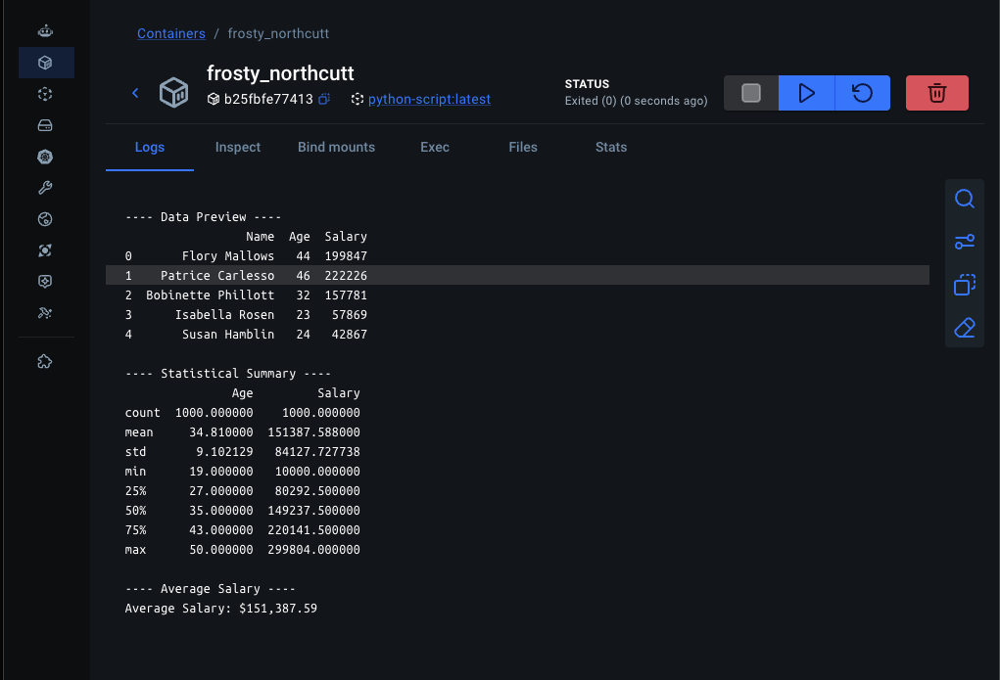

First steps into Docker and containerization.

# Project 2: Dockerizing a Python Script

This project demonstrates how to containerize a Python data processing script that uses the pandas library.

### Goal
Learn how to manage Python dependencies and run scripts reliably inside Docker containers.

---

## Technologies Used
- Docker
- Python 3.12
- pandas

---

## Project Structure
python-docker-script/.  
├── process_data.py.  
├── data/.        
│   └── data.csv.  
├── requirements.txt.  
├── Dockerfile.  
└── README.md.   


## How to Run

### 1. Build the Docker Image
```
docker build -t python-script .
```

2. Run the Container with Volume Mount
macOS / Linux:
``` docker run -v $(pwd)/data:/app/data python-script ```.  
Windows (PowerShell):
```docker run -v ${PWD}/data:/app/data python-script```

Expected Output

Data preview from data.csv
Statistical summary (describe)
Average salary calculation


Key Learnings

Installing dependencies using requirements.txt
Using WORKDIR, COPY, and RUN in Dockerfile
Volume mounting to share data between host and container
Making Python scripts portable and reproducible