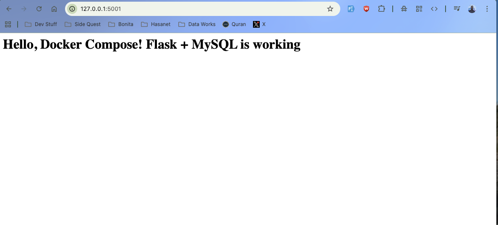

# Project 3: Flask + MySQL Multi-Container Application

This project builds a simple multi-container web application using Flask as the frontend and MySQL as the backend database, orchestrated with Docker Compose.

### Goal
Learn how to manage multiple interconnected containers using Docker Compose.

---

## Technologies Used
- Docker Compose
- Flask
- MySQL 8.0
- mysql-connector-python

---

## Project Structure
flask-mysql-docker/   
├── app.py   
├── requirements.txt   
├── Dockerfile.  
├── docker-compose.yml   
└── README.md   


## How to Run

1. Start the Application
```docker compose up --build```.  

2. Access the Web App
Open your browser and go to:
http://localhost:5001   
You should see the message:
Hello, Docker Compose! Flask + MySQL is working 🎉


Key Learnings

Orchestrating multiple services with docker-compose.yml
Defining service dependencies and healthchecks
Connecting containers using service names (host: "db")
Handling database startup timing issues
Volume management for persistent data