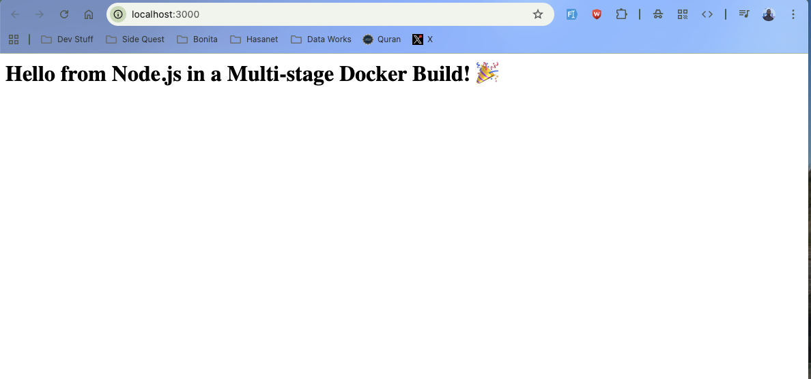

Here's a clean, professional, and beginner-friendly **README.md** for **Project 4: Multi-stage builds for a Node.js App**.

```markdown
# Project 4: Multi-Stage Docker Build with Node.js

This project demonstrates how to use **multi-stage Docker builds** to create optimized, production-ready Docker images for a Node.js application.

### Goal
Learn how to significantly reduce Docker image size by separating the **build environment** from the **runtime environment**.

---

## Project Overview

- **Framework**: Express.js (Node.js)
- **Technologies**: Docker, Multi-stage builds, Node.js 20, Alpine Linux
- **Final Image Size**: ~150–200 MB (much smaller than a single-stage build)

---

## Project Structure

```
004 Multi-stage build for a Node.js App/
├── server.js
├── package.json
├── .dockerignore
├── Dockerfile
└── README.md
```

---

## Files Explanation

### 1. `server.js`
Simple Express web server that returns a welcome message on the root route (`/`).

### 2. `package.json`
Contains project metadata and dependencies (Express).

### 3. `.dockerignore`
Excludes unnecessary files from the Docker build context (e.g., `node_modules`, logs, git files) to keep builds fast and clean.

### 4. `Dockerfile` (Multi-stage Build)

The Dockerfile uses **two stages**:

- **Stage 1 (Builder)**: Uses `node:20-alpine` to install dependencies and copy source code.
- **Stage 2 (Production)**: Uses a clean `node:20-alpine` image, copies only the necessary files, and runs the app as a non-root user for better security.

This approach dramatically reduces the final image size and improves security.

---

## How to Run the Project

### 1. Build the Docker Image

```bash
docker build -t node-multi-stage .
```

### 2. Run the Container

**Option A (Recommended - Avoid port conflicts on macOS)**

```bash
docker run -d -p 3001:3000 node-multi-stage
```

**Option B (Use default port 3000)**

```bash
docker run -d -p 3000:3000 node-multi-stage
```

### 3. Access the Application

Open your browser and visit:

- **http://localhost:3001** (if using port 3001)  
- **http://localhost:3000** (if using port 3000)

You should see:



---

## Useful Docker Commands

```bash
# View running containers
docker ps

# See logs
docker logs <container-id>

# Stop the container
docker stop <container-id>

# Check image size
docker images node-multi-stage

# Remove the container
docker rm <container-id>

# Clean up everything (optional)
docker system prune -f
```

---

## Key Learnings

- What multi-stage builds are and why they matter
- How to reduce Docker image size significantly
- Best practices: using `.dockerignore`, `npm ci`, non-root user, and Alpine base images
- Difference between build stage and runtime stage
- Layer caching for faster builds

---

## Possible Improvements (Next Steps)

- Add Nginx as a reverse proxy in the final stage
- Use `distroless` Node.js image for even smaller size
- Add Docker Healthcheck
- Add environment variables and configuration
- Containerize a React/Vue frontend with this approach

---

**Created as part of Docker Learning Projects**  
**Technologies**: Docker • Node.js • Express • Multi-stage Builds