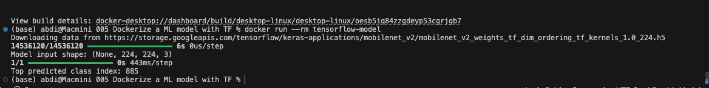

# Project 5: Dockerizing a Machine Learning Model with TensorFlow

This project demonstrates how to containerize a TensorFlow machine learning model using Docker. The goal is to create a portable and reproducible environment for running TensorFlow models across different systems without worrying about local setup or dependency issues.

---

## Goal
- Learn how to run TensorFlow inside a Docker container
- Understand the challenges of packaging heavy ML libraries
- Create a consistent environment for machine learning workloads

---

## Technologies Used
- Docker
- TensorFlow 2.16
- Python
- MobileNetV2 (pre-trained model from Keras Applications)

---

## Project Structure

```
tensorflow-model-docker/
├── model.py
├── Dockerfile
├── .dockerignore
└── README.md
```

---

## Files Explanation

### `model.py`
A Python script that:
- Loads the pre-trained **MobileNetV2** model (ImageNet weights)
- Prints TensorFlow version and model information
- Runs a dummy prediction to verify the model works

### `Dockerfile`
```dockerfile
FROM tensorflow/tensorflow:2.16.1

WORKDIR /app
COPY . .
CMD ["python", "model.py"]
```

Uses the official TensorFlow Docker image which comes with all necessary dependencies pre-installed.

---

## How to Run

### 1. Build the Docker Image

```bash
docker build -t tensorflow-model .
```

> **Note**: The first build may take several minutes as it downloads the large TensorFlow image (~600–800 MB).

### 2. Run the Container

```bash
docker run --rm tensorflow-model
```

The `--rm` flag automatically removes the container after execution.

---

## Expected Output

You should see something similar to:


---

## Useful Commands

```bash
# Rebuild the image
docker build -t tensorflow-model .

# Run with interactive shell (for debugging)
docker run -it --rm tensorflow-model bash

# Check image size
docker images tensorflow-model

# Remove all stopped containers
docker container prune
```

---

## Key Learnings

- How to use official TensorFlow Docker images
- Packaging heavy machine learning libraries with Docker
- Running pre-trained deep learning models in containers
- Understanding the trade-off between ease-of-use and image size
- Creating reproducible ML environments

---

## Challenges Faced

- Large image size (TensorFlow is heavy)
- Long first-time build and model download
- High resource usage (CPU/RAM)

---

## Possible Improvements (Next Steps)

- Add a **FastAPI** web interface to upload images and get predictions
- Use **TensorFlow Serving** for production model deployment
- Convert model to **TensorFlow Lite** for much smaller image size
- Implement multi-stage builds to reduce final image size
- Add GPU support (`tensorflow/tensorflow:latest-gpu`)

---

