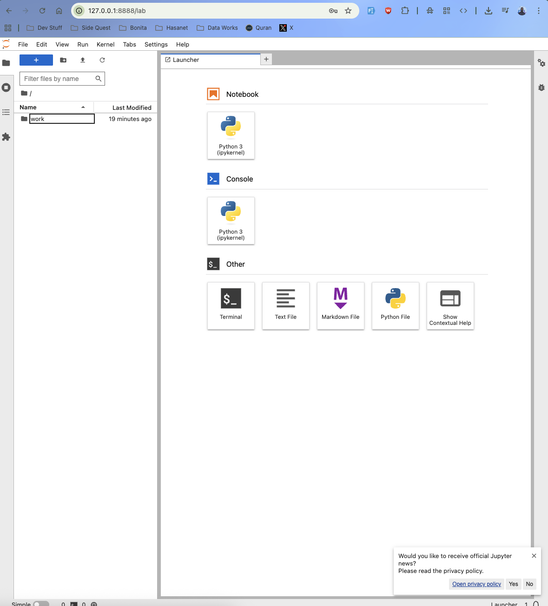

### Data Science Environment with Jupyter Notebook using Docker

This project creates a reproducible and portable data science environment using Jupyter Notebook inside Docker. It comes pre-loaded with popular data science libraries.

### Goal
Learn how to set up a ready-to-use data science workspace with Docker Compose that can be shared and run consistently on any machine.

---

## Technologies Used
- Docker Compose
- Jupyter Notebook / JupyterLab
- Python 3
- pandas, NumPy, Matplotlib, scikit-learn, SciPy

---

## Project Structure
jupyter-ds-environment/   
├── docker-compose.yml   
├── notebooks/          # All your Jupyter notebooks go here.  
└── README.md


## How to Run

## 1. Start the Jupyter Environment
Run in background (recommended).  
```docker compose up -d```.   
2. Access Jupyter Notebook
Open your browser and go to:
http://localhost:8888.  
You should see the JupyterLab interface.   

Note: If prompted for a token, run the following command:Bashdocker compose exec jupyter jupyter server list
3. Stop the Environment
```docker compose down```

## Key Features

Pre-installed scientific Python stack (jupyter/scipy-notebook)
Persistent storage via volume mount (./notebooks)
JupyterLab enabled by default
Easy to extend with additional packages


## Useful Commands
```docker compose up -d              # Start in background
docker compose down               # Stop services
docker compose logs -f jupyter    # View live logs
docker compose exec jupyter bash  # Enter the container shell
Installing Extra Packages
docker compose exec jupyter pip install seaborn plotly tensorflow
```

## Key Learnings

Using official Jupyter Docker images
Managing development environments with Docker Compose
Volume mounting for persistent notebooks
Creating reproducible data science workspaces

