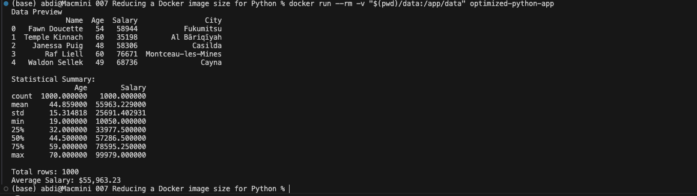

# Project 7: Reducing Docker Image Size for a Python Application

This project focuses on optimizing Docker images using **multi-stage builds** and lightweight base images to create a minimal, production-ready Python application.

### Goal
Learn advanced Docker optimization techniques to significantly reduce image size while maintaining functionality.

---

## Technologies Used
- Docker (Multi-stage builds)
- Python 3.12
- pandas
- Alpine / Slim base images

---

## Project Structure
optimized-python-app/   
├── script.py.  
├── requirements.txt.  
├── data/.  
│   └── data.csv.  
├── Dockerfile.  
└── README.md.  


## Optimized Dockerfile Highlights

- **Multi-stage build**: Separates dependency installation from runtime
- Uses `python:3.12-slim` base image
- Installs only necessary build dependencies in the builder stage
- Runs as non-root user for better security
- Excellent layer caching for faster rebuilds

---

## How to Run

### 1. Build the Optimized Image


``` docker build -t optimized-python-app . ```  
2. Run the Container.  

## macOS / Linux
``` docker run --rm -v "$(pwd)/data:/app/data" optimized-python-app ```


## Windows (PowerShell)
```docker run --rm -v ${PWD}/data:/app/data optimized-python-app```

Expected Output




## Check Image Size
Bashdocker images optimized-python-app
Compare this size with a single-stage version — multi-stage builds can reduce size dramatically.

## Key Learnings

Multi-stage Docker builds (AS builder).  
Using slim and Alpine base images.  
Proper dependency management and layer caching.  
Running containers as non-root users.  
Trade-offs between image size, build time, and compatibility.  


## Possible Further Optimizations

Use python:3.12-alpine with proper build dependencies.  
Implement virtual environments.  
Use distroless Python images.  
Add .dockerignore for cleaner builds.  