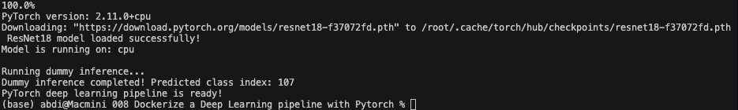

# Project 8: Dockerizing a Deep Learning Pipeline with PyTorch

This project shows how to containerize a simple PyTorch inference pipeline with Docker. It uses a pre-trained **ResNet18** model from `torchvision`, runs a dummy inference pass, and prints confirmation that the deep learning environment is working correctly inside the container.

---

## Goal

- Learn how to package a PyTorch-based workflow in Docker
- Build a reproducible environment for deep learning inference
- Understand practical Docker considerations for Apple Silicon Macs

---

## Technologies Used

- Docker
- Python 3.12
- PyTorch
- Torchvision
- PIL / Pillow
- ResNet18 (pre-trained on ImageNet)

---

## Project Structure

```text
pytorch-model-docker/
├── model.py
├── requirements.txt
├── Dockerfile
└── README.md
```

---

## Files Explanation

### `model.py`

A Python script that:

- Prints the installed PyTorch version
- Loads a pre-trained `ResNet18` model
- Switches the model to evaluation mode
- Runs a dummy inference using random input
- Prints the predicted class index

### `requirements.txt`

Contains the extra Python packages used by the project:

- `torchvision`
- `pillow`

### `Dockerfile`

```dockerfile
FROM python:3.12-slim

WORKDIR /app

RUN pip install --no-cache-dir torch torchvision torchaudio --index-url https://download.pytorch.org/whl/cpu

COPY requirements.txt .
RUN pip install --no-cache-dir -r requirements.txt

COPY model.py .

CMD ["python", "model.py"]
```

This Dockerfile uses a lightweight Python base image and installs PyTorch from the official PyTorch wheel index.

---

## How to Run

### 1. Build the Docker Image

Run this command from inside the `008 Dockerize a Deep Learning pipeline with Pytorch` folder:

```bash
docker build -t pytorch-model .
```

### 2. Run the Container

```bash
docker run --rm pytorch-model
```

The `--rm` flag removes the container automatically after it finishes.

---

## Expected Output

You should see output similar to:



Note:
- The exact PyTorch version may differ
- The predicted class index will vary between runs because the input is random
- The first run may take longer because model weights are downloaded

---

## Apple Silicon Note

This project works well on a Mac Mini with Apple Silicon, but Docker containers on macOS run as Linux containers. That means:

- The container uses **CPU execution**
- Apple `MPS` acceleration is not available in a standard Docker container
- This setup is still great for learning, testing, and portable inference demos

---

## Useful Commands

```bash
# Rebuild without cache
docker build --no-cache -t pytorch-model .

# Run the container
docker run --rm pytorch-model

# Open a shell inside the image
docker run -it --rm pytorch-model bash

# Check image size
docker images pytorch-model
```

---

## Key Learnings

- How to Dockerize a PyTorch inference script
- Using pre-trained computer vision models inside a container
- Creating reproducible deep learning environments
- Understanding the difference between local Apple Silicon acceleration and Linux container execution
- Managing large ML dependencies in Docker

---

## Challenges Faced

- PyTorch images and dependencies can be large
- The first build and first model download may take time
- Some package names and installation steps differ on newer base images
- Apple GPU acceleration does not carry over into a standard Linux Docker container

---

## Possible Improvements

- Add a `.dockerignore` file to reduce build context
- Save model weights during image build for faster container startup
- Replace the dummy inference with real image classification input
- Build a FastAPI or Flask endpoint around the model
- Add a `docker-compose.yml` for future multi-service ML workflows
